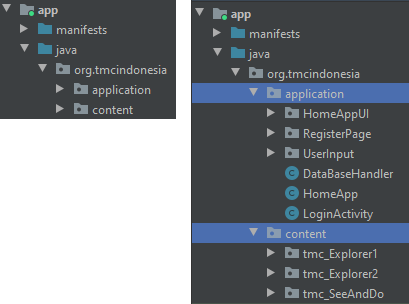
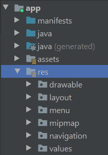

# **The Mail Box Club - Indoneisa App**

**About The Mail Box Club:** In 1965, George & Laura Eager began The Mailbox Club as a follow-up ministry to children reached through his assembly programs in rural schools in the Southeast. This wonderful school ministry spanned over 50 years touching the lives of over 1.3 million children and youth! But God had bigger plans and the ministry spread across the country as others saw the value of discipling children and young people through Bible correspondence courses.

John Mark Eager joined TMC in 1990 to help a ministry partner develop a discipleship program for children in Eastern Europe using TMC Bible lessons. But again, God had bigger plans. Last year, God expanded the ministry to 86 countries, with over 4.4 million students enrolled, mostly children! Today, the majority of our lessons are not distributed to children through the mail, but rather children are discipled by mentors in small in schools, clubs, and churches.

TMC lessons are true to the Word of God, and written at a level children can understand. We believe every child should hear the Gospel in their own language.

**About The App:** online learning platform where children can access the ebooks and write their story about their journey with Jesus.

<a href="https://play.google.com/store/apps/details?id=org.tmcindonesia.tmc_explorer" target="_blank"></a>


_Note: This is a repo for building Android Mobile Application. This repo is in **active development**_
| Technology Stack |
| ------------------------------------------------ |
| [Java](https://www.oracle.com/java/technologies) |
| [SQLite](https://www.sqlite.org/index.html) |
| [Firebase](https://firebase.google.com/) |

## Development

This is a standard android mobile application developed using [android studio IDE.](developer.android.com/studio) Clone this repo to get the source code and open it using android studio IDE. To get the design resource please open [google drive DataIT TMC Indonesia.](https://drive.google.com/drive/folders/1G-ZICkL-PWgN5b7FrpcNB74Orf2INj6T?usp=sharing)

run the following command in terminal to clone git repository

```bash
# clone the repository
$ git clone https://github.com/reizkian/TMC-app.git
```

_Note: follow this tutorial to learn about [git](https://www.youtube.com/watch?v=SWYqp7iY_Tc&t=663s&ab_channel=TraversyMedia)_

before build the app, please make sure under the file 'Gradle Scripts/build.gradle' module the parameter compiledSdkVersion is 30 and minSdkVersion is 23.


```gradle
android {
    compileSdkVersion 30
    buildToolsVersion "30.0.2"
    defaultConfig {
        applicationId "org.tmcindonesia"
        minSdkVersion 23
        targetSdkVersion 30
        versionCode 2
        // version name MAJOR.MINOR.PATCH (changeAPI.Features/Functionality.BugFixed)
        versionName "1.1.0"
        testInstrumentationRunner "androidx.test.runner.AndroidJUnitRunner"
    }
```

before running the app on your android phone, first, connect your phone to the computer. please make sure that you have activated the [Develeoper Option for USB Debugging](https://developer.android.com/studio/debug/dev-options) in your phone settings and the android studio IDE can detect your phone as shown in the picture bellow. Otherwise, you can run the app on a virtual device by configuring it on AVD Manager (create a virtual device: allocating ram, disk, and processing power)


## File Structure Documentation

This section explains the file structure as general so any future developer and mantainer could navigate between directory and understand what each files does.

### Java Classes

**Under the directory 'app/java/org.tmcindonesia'** there are two directory: application and content.

The application directory contains **Java Classes** to handle the general fuctionality of the apps such as user login authentication, local SQLite database, network handling, read/write user data or input to the Firebase Backend Server, and general UI rendering functionality.

The content directory contains java classes to render PDF file and handling user input for 'Question Pages' in each lessons.



### Resources

**Under the directory 'app/res/'** there are several directory used for rendering the user interface.

The drawable directory contains all the images resources for icon and component available in png format or other vector image format.

The layout directory contains XML files which specifying "where to render" for all the images (or text in string value) resources implemented as an icon or component for each specific page in the application.

The value directory contains XML files which specify special parameters used in layout XML files.



# Code Documentation

Code documentation provided as a comment in each Java.class and XML files.

_Note: not all variable, method, object, and classes are documented. For more documentation request please notify [reizkian](https://github.com/reizkian). If you have found any issue please mention it [here](https://github.com/reizkian/TMC-app/issues)_

God Bless You! :smile:
